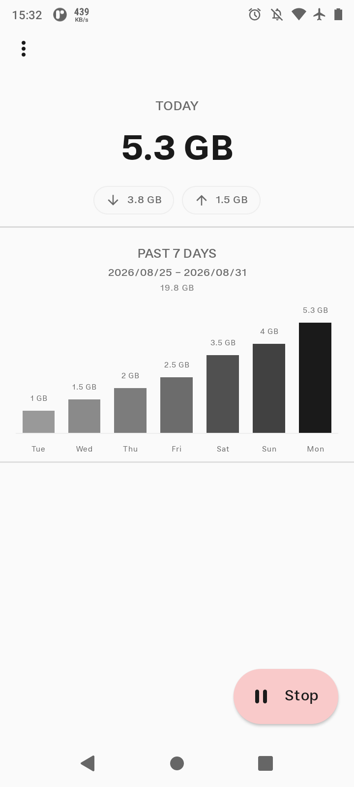
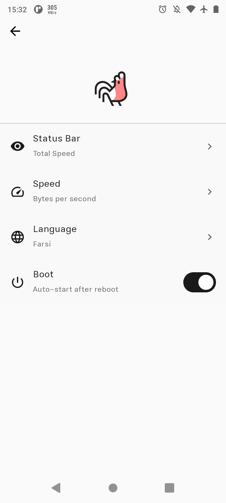
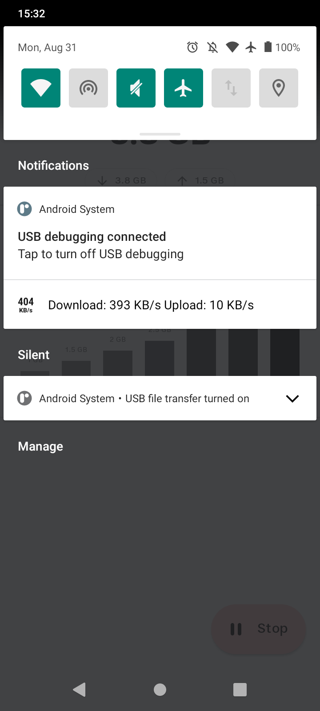
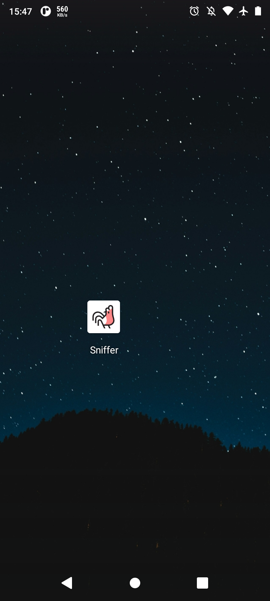

# Sniffer

**Sniffer** is a lightweight Android application that monitors your network speed and data usage in real-time.

  
  
  
  

## License

This project is licensed under the GNU General Public License v3.0 or later.

